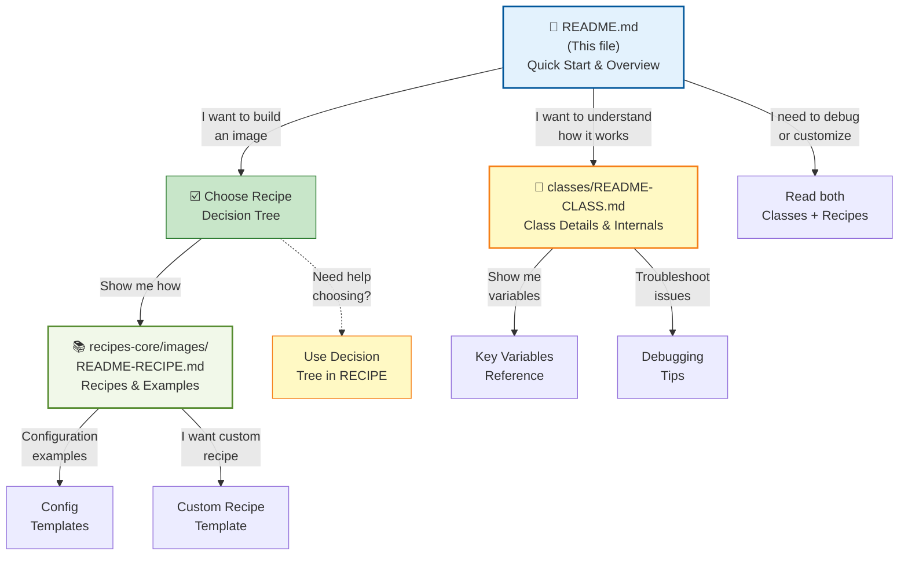

# meta-raspberrypi-simpat

**Presentation**

This meta-layer will allow us to apply some concepts in YOCTO.
We can learn how to build the simplest C/C++ code, Linux drivers, and Python 3 applications.
For many of you, when you start to build a Linux system, you use an SD card to store the Linux OS.
You waste time burning SD cards instead of using a boot system like TFTP or NFS.


**Electronic Board** 

* Raspberrypi5
* Raspbberypi4
* Raspberrypi3

# Depencies with others layers

layer meta-raspberrypi get dependance with layers:

* meta-raspberrypi
* core.  

[link layer.conf](conf/layer.conf)

---

# Documentation Structure

This layer's documentation is organized into three levels:

1. **[README.md](README.md)** (this file) - Quick overview and usage guide
2. **[classes/README-CLASS.md](classes/README-CLASS.md)** - Detailed class documentation
3. **[recipes-core/images/README-RECIPE.md](recipes-core/images/README-RECIPE.md)** - Detailed recipe documentation

### Documentation Navigation Map



---

# Architecture Overview

The layer's architecture is built on **two core classes** that work together with multiple image recipes to provide flexible Raspberry Pi imaging:

## Class Architecture

```
┌─────────────────────────────────────────────────────────────┐
│                    image-support (Base)                     │
│                                                             │
│  • Auto-detects deployment type (SD Card vs TFTP)          │
│  • Manages WIC configuration for SD Card images            │
│  • Handles TFTP/NFS boot file deployment                   │
│  • Bootloader detection (U-Boot vs EEPROM)                 │
└────────────────────────┬────────────────────────────────────┘
                         │
                         │ (inherits)
                         │
┌────────────────────────▼────────────────────────────────────┐
│              support-img-type (SD Card specific)            │
│                                                             │
│  • Configures image type (rootfs/ramfs/nfs)               │
│  • Sets WKS (kickstart) file based on type                │
│  • Manages boot files generation                          │
│  • Handles kernel bundling for initramfs images           │
└─────────────────────────────────────────────────────────────┘
```

## Class Descriptions

### 1. `image-support` (Base Class)

**Purpose:** Provides the foundation for all Raspberry Pi image deployment types.

**Key Features:**
- **Auto-Detection:** Automatically detects whether to build a **SD Card image** (with WIC) or a **TFTP network boot** image
- **WIC Configuration:** Sets up disk partitioning, boot partition size, rootfs filesystem type (ext4)
- **TFTP Deployment:** Automatically deploys boot files (kernel, DTB, bootloader) to a TFTP server folder
- **Bootloader Support:** Detects U-Boot support from `DISTRO_FEATURES` and adapts configuration accordingly
- **Network Configuration:** Sets TFTP and NFS folder paths

**Usage:** Inherited by all image recipes (both SD Card and TFTP variants)

**Key Variables:**
- `SUPPORT_BOOT`: Indicates boot type ("sdcard" or "tftp")
- `IMAGE_SUPPORT_MEDIA`: Media type (default: "sdcard")
- `TFTP_BOOT_FOLDER`: Where to deploy TFTP boot files (default: "/tmp/srv/tftp")
- `FOLDER_NFS_SERVER`: Where to deploy NFS rootfs (default: "/tmp/srv/nfsroot")

---

### 2. `support-img-type` (Image Type Specific)

**Purpose:** Configures image type-specific behaviors for **SD Card images only**.

**Key Features:**
- **Image Type Mapping:** Maps image types (rootfs/ramfs/nfs) to WKS kickstart files
- **Kernel Configuration:** Handles kernel bundling with initramfs for RAMFS images
- **Boot Files Generation:** Automatically assembles correct boot files based on image type
- **Command Line Parameters:** Sets appropriate kernel command-line based on boot method

**Usage:** Inherited ONLY by SD Card image recipes, NOT by TFTP recipes

**Key Variables:**
- `SUPPORT_IMG_TYPE`: Image type ("rootfs", "ramfs", or "nfs")
- `INITRAMFS_IMAGE`: Initramfs image to bundle (for RAMFS type)
- `IP_SERVER_NFS`: NFS server IP address
- `FOLDER_NFS_SERVER`: NFS server folder path

---

## 📚 Detailed Documentation

**For comprehensive class documentation:**
→ See [classes/README-CLASS.md](classes/README-CLASS.md)

**For detailed recipe documentation:**
→ See [recipes-core/images/README-RECIPE.md](recipes-core/images/README-RECIPE.md)

---

## Image Recipes

The layer provides **6 image recipes** organized into two groups:

### Quick Overview

**SD Card Images:**
- `simpat-image-sdcard-rootfs` - Standard SD card with local ext4 rootfs
- `simpat-image-sdcard-nfs` - SD card with NFS-mounted rootfs
- `simpat-image-sdcard-ramfs` - SD card with bundled initramfs (RAM boot)

**TFTP/Network Images:**
- `simpat-image-tftp` - Basic TFTP boot with tar.bz2 rootfs
- `simpat-image-tftp-nfs` - Complete network boot (TFTP + NFS)
- `simpat-image-tftp-ramfs` - TFTP boot with RAM rootfs

### Detailed Recipe Information

👉 **For complete recipe documentation, configuration options, and examples:**
→ See [recipes-core/images/README-RECIPE.md](recipes-core/images/README-RECIPE.md)

### Quick Configuration Examples

**SD Card Images (inherit both `image-support` + `support-img-type`):**
```bitbake
require recipes-core/images/core-image-minimal.bb
inherit image-support support-img-type

SUPPORT_IMG_TYPE = "nfs"
IP_SERVER_NFS = "192.168.1.100"
FOLDER_NFS_SERVER = "/tmp/nfs/rootfs"
```

**TFTP Images (inherit only `image-support`):**
```bitbake
require recipes-core/images/core-image-minimal.bb
inherit image-support

SUPPORT_BOOT = "tftp"
TFTP_BOOT_FOLDER = "/tmp/srv/tftp"
FOLDER_NFS_SERVER = "/tmp/srv/nfsroot"
```

---

## Deployment Modes Reference

| Feature | SD Card + Rootfs | SD Card + NFS | SD Card + RAMFS | TFTP + Rootfs | TFTP + NFS | TFTP + RAMFS |
|---------|---|---|---|---|---|---|
| Storage | Local ext4 | Network NFS | RAM (initramfs) | Network TAR | Network NFS+TAR | RAM (bundled kernel) |
| Boot Time | Medium | Fast | Fastest | Medium | Fast | Fastest |
| Boot Files | SD card | SD card | SD card | TFTP | TFTP | TFTP |
| Rootfs | SD card | NFS | Kernel | Network | NFS | Kernel |
| Recipe | `simpat-image-sdcard-rootfs` | `simpat-image-sdcard-nfs` | `simpat-image-sdcard-ramfs` | `simpat-image-tftp` | `simpat-image-tftp-nfs` | `simpat-image-tftp-ramfs` |

---

## Quick Build Examples

### Build SD Card with Local Rootfs:
```bash
bitbake simpat-image-sdcard-rootfs
# Output: .wic image ready to burn to SD card
```

### Build SD Card with NFS Boot:
```bash
bitbake simpat-image-sdcard-nfs
# Configurable: IP_SERVER_NFS, FOLDER_NFS_SERVER
```

### Build Complete Network Boot (TFTP + NFS):
```bash
bitbake simpat-image-tftp-nfs
# Auto-deploys:
#   1. Kernel + DTB to /tmp/srv/tftp/
#   2. Rootfs to /tmp/srv/nfsroot/
```

---

## Advanced Topics

👉 **For advanced configuration:**
- Class internals and Python functions → [classes/README-CLASS.md](classes/README-CLASS.md)
- Detailed bootloader support → [classes/README-CLASS.md](classes/README-CLASS.md#bootloader-support)
- Custom image recipes → [recipes-core/images/README-RECIPE.md](recipes-core/images/README-RECIPE.md#creating-custom-recipes)
- Troubleshooting → [classes/README-CLASS.md](classes/README-CLASS.md#debugging-and-troubleshooting)

---

## WIC Templates

The layer includes WKS (kickstart) files in `wic/` directory for SD Card partitioning:

- `sdcard-rootfs.wks.in` - Two partitions (boot + ext4 rootfs)
- `sdcard-nfs.wks.in` - One partition (boot only, rootfs via NFS)
- `sdcard-ramfs.wks.in` - One partition (boot only, initramfs bundled)

Automatically selected based on `SUPPORT_IMG_TYPE`.

---

## Bootloader Support

The layer automatically detects bootloader type:

- **U-Boot:** When `uboot` is in `DISTRO_FEATURES` → Uses partition 3 for rootfs
- **EEPROM (Default):** Raspberry Pi native → Uses partition 2 for rootfs

Handled transparently by `image-support` and `rpi-cmdline.bbappend`.

---

## How the Classes Work Together

### Build Flow for SD Card Images

```
Your Recipe (simpat-image-sdcard-nfs)
    ↓
Inherits image-support → Auto-enables WIC, skips TFTP deployment
    ↓
Inherits support-img-type → Maps type to WKS file (sdcard-nfs.wks.in)
    ↓
BitBake generates .wic image using WIC tool
    ↓
Output: Ready to burn to SD card
```

### Build Flow for TFTP Images

```
Your Recipe (simpat-image-tftp-nfs)
    ↓
Inherits image-support → Enables TFTP deployment, uses tar.bz2
    ↓
BitBake generates tar.bz2 rootfs
    ↓
do_tftp_deploy runs automatically
    ├─ Copies kernel, DTB, bootfiles to /tmp/srv/tftp/
    └─ Extracts rootfs to /tmp/srv/nfsroot/
    ↓
Output: Files ready for TFTP/NFS boot
```

---

## Documentation Map

| Document | Purpose | Audience |
|----------|---------|----------|
| **README.md** | Quick overview, common tasks | Everyone |
| **[classes/README-CLASS.md](classes/README-CLASS.md)** | Class internals, configuration, debugging | Advanced users, developers |
| **[recipes-core/images/README-RECIPE.md](recipes-core/images/README-RECIPE.md)** | Recipe details, examples, customization | Recipe developers |

---

## Getting Started

1. **Choose your deployment type:**
   - 🎯 SD Card with local storage? → `simpat-image-sdcard-rootfs`
   - 🎯 Network boot with NFS? → `simpat-image-tftp-nfs`
   - 🎯 RAM-based boot? → `simpat-image-sdcard-ramfs` or `simpat-image-tftp-ramfs`

2. **Build the image:**
   ```bash
   bitbake simpat-image-sdcard-rootfs
   ```

3. **Check the recipe documentation** for advanced configuration:
   → [recipes-core/images/README-RECIPE.md](recipes-core/images/README-RECIPE.md)

4. **Debug issues:**
   → [classes/README-CLASS.md#debugging-and-troubleshooting](classes/README-CLASS.md#debugging-and-troubleshooting)

---

## Summary

The `meta-raspberrypi-simpat` layer provides a clean, maintainable approach to building Raspberry Pi images:

✅ **2 reusable classes** - Automatic detection and configuration  
✅ **6 image recipes** - From basic SD cards to complete network boot  
✅ **Smart defaults** - Works out-of-the-box for common scenarios  
✅ **Flexible configuration** - Override any setting for custom needs  
✅ **Network boot support** - TFTP/NFS for development and testing  
✅ **Complete documentation** - From quick start to advanced debugging  

---

**Need more details?**

👉 Classes deep-dive: [classes/README-CLASS.md](classes/README-CLASS.md)  
👉 Recipe details: [recipes-core/images/README-RECIPE.md](recipes-core/images/README-RECIPE.md)  
👉 WKS templates: See `wic/` directory  
👉 Main project: [README.md](README.md)

