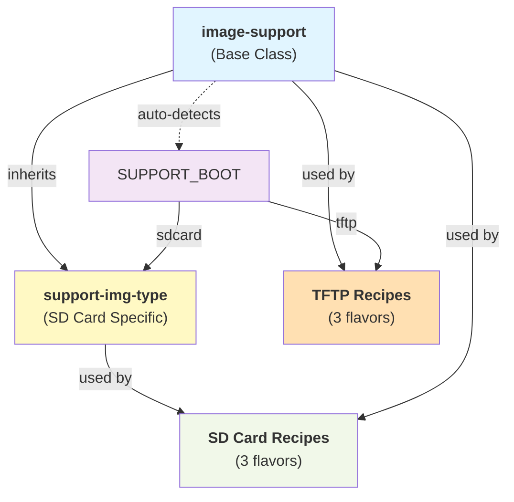
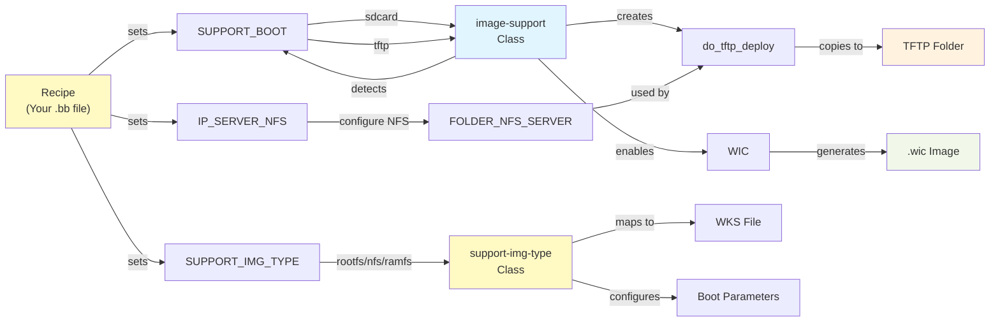
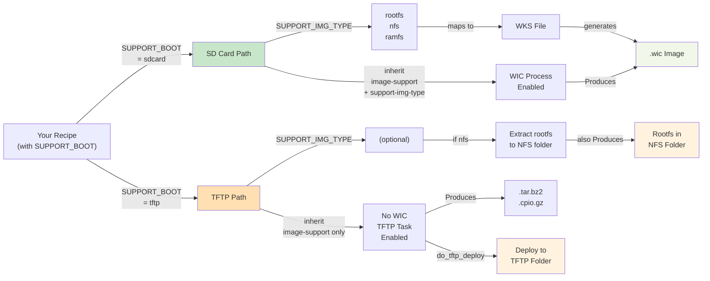

# Classes Documentation

This document provides comprehensive documentation for the `meta-raspberrypi-simpat` layer's core classes.

---

## Overview

The layer provides **2 core classes** that work together to support multiple deployment scenarios:

1. **`image-support`** - Base class for all image types (SD Card + TFTP)
2. **`support-img-type`** - Image type-specific configuration (SD Card only)

### Class Relationships



---

## 1. `image-support` bbclass

**File Location:** `classes/image-support.bbclass`

**Purpose:** Provides the foundation for all Raspberry Pi image deployment types with automatic detection and configuration.

### Responsibilities

- **Auto-Detection:** Intelligently detects deployment type based on `SUPPORT_BOOT` variable
- **WIC Management:** Configures WIC (Wicked Image Creator) for SD Card/eMMC deployments
- **TFTP Deployment:** Automatically deploys boot files to TFTP server during build
- **NFS Support:** Configures NFS root filesystem deployment
- **Bootloader Detection:** Auto-detects U-Boot vs EEPROM bootloader
- **Boot Files Assembly:** Gathers kernel, DTB, bootloader files for deployment

### Key Variables

| Variable | Default | Purpose |
|----------|---------|---------|
| `SUPPORT_BOOT` | (required) | Deployment type: "sdcard" or "tftp" |
| `IMAGE_SUPPORT_MEDIA` | "sdcard" | Physical media type |
| `TFTP_BOOT_FOLDER` | "/tmp/srv/tftp" | TFTP server deployment folder |
| `FOLDER_NFS_SERVER` | "/tmp/srv/nfsroot" | NFS rootfs deployment folder |
| `IMAGE_BOOT_FILES` | (auto) | Boot files to deploy |
| `RPI_USE_U_BOOT` | (auto) | Detected from DISTRO_FEATURES |

### WIC Configuration Variables

Used only for SD Card deployments:

| Variable | Default | Purpose |
|----------|---------|---------|
| `SUPPORT_WIC_DISK_DEV` | "mmcblk0" | Disk device name |
| `SUPPORT_WIC_PARTITION_ALIGN` | "4096" | Partition alignment (bytes) |
| `SUPPORT_WIC_BOOT_PARTITION_LABEL` | "boot" | Boot partition label |
| `SUPPORT_WIC_BOOT_PARTITION_SIZE` | "64" | Boot partition size (MB) |
| `SUPPORT_WIC_ROOTFS_PARTITION_LABEL` | "root" | Rootfs partition label |
| `SUPPORT_WIC_ROOTFS_PARTITION_FSTYPE` | "ext4" | Rootfs filesystem type |
| `SUPPORT_WIC_EXTRA_ARGS` | "" | Additional WIC arguments |

### Python Functions

#### `make_dtb_boot_files(d)`

Generates boot file entries for device tree binaries from `KERNEL_DEVICETREE` variable.

**Returns:** Space-separated string of DTB boot file entries

**Example:**
```
bcm2712-rpi-5-b.dtb=${DEPLOY_DIR_IMAGE}/bcm2712-rpi-5-b.dtb;bcm2712-rpi-5-b.dtb
```

### Auto-Detection Flow

The `__anonymous()` function runs at parse-time to auto-configure:

```python
python __anonymous() {
    fstypes = d.getVar('IMAGE_FSTYPES').split()
    support_boot = d.getVar('SUPPORT_BOOT') or ""
    
    if support_boot == "tftp":
        # Skip WIC for TFTP images
        # TFTP images use tar.bz2 or cpio.gz formats
        pass
    else:
        # Enable WIC for SD Card images
        # Add WIC to IMAGE_FSTYPES if not present
        pass
}
```

### TFTP Deployment Task

#### Task: `do_tftp_deploy`

**Trigger:** Automatically runs after `do_image_complete` for all images

**Skip Condition:** Only executes when `SUPPORT_BOOT == "tftp"`

**Behavior for TFTP images:**
1. Creates TFTP boot folder (`$TFTP_BOOT_FOLDER`)
2. Extracts kernel image from deploy directory
3. Extracts device tree binaries (DTB)
4. Copies bootloader files (start*.elf, fixup*.dat)
5. Copies device tree overlays (*.dtbo files)
6. For NFS images: Extracts rootfs tarball to `$FOLDER_NFS_SERVER`

**Task Properties:**
```bitbake
do_tftp_deploy[nostamp] = "1"  # Always runs (no state tracking)
addtask do_tftp_deploy after do_image_complete before do_build
```

**Deployment Outputs:**

For TFTP images, files are copied to `TFTP_BOOT_FOLDER`:
- `kernel_*.img` - Kernel image
- `*.dtb` - Device tree binaries
- `*.dtbo` - Device tree overlays
- `bootfiles/*` - Bootloader files (start*.elf, fixup*.dat, bootcode.bin)
- `config.txt`, `cmdline.txt` - Boot configuration

For TFTP+NFS images, rootfs is extracted to `FOLDER_NFS_SERVER`:
- Complete Linux filesystem accessible via NFS mount point

### Inheritance Examples

**For SD Card Images:**
```bitbake
require recipes-core/images/core-image-minimal.bb
inherit image-support support-img-type
SUPPORT_BOOT := "sdcard"
```

**For TFTP Images:**
```bitbake
require recipes-core/images/core-image-minimal.bb
inherit image-support
SUPPORT_BOOT := "tftp"
```

### Backward Compatibility

The class provides legacy variable mappings for old `SIMPAT_*` variable names:

```bitbake
SIMPAT_WIC_DISK_DEV ?= "${SUPPORT_WIC_DISK_DEV}"
SIMPAT_WIC_BOOT_PARTITION_SIZE ?= "${SUPPORT_WIC_BOOT_PARTITION_SIZE}"
# ... etc for all SIMPAT_ variables
```

Old recipes using `SIMPAT_*` variables will continue to work by mapping to the new `SUPPORT_*` names.

---

## 2. `support-img-type` bbclass

**File Location:** `classes/support-img-type.bbclass`

**Purpose:** Configures image type-specific behaviors for **SD Card images only**.

### Note

⚠️ **This class is only inherited by SD Card image recipes, NOT by TFTP recipes.**

TFTP recipes inherit only `image-support`.

### Responsibilities

- **Image Type Mapping:** Maps `SUPPORT_IMG_TYPE` to WKS kickstart files
- **Kernel Configuration:** Handles kernel bundling with initramfs for RAMFS images
- **Boot Files Assembly:** Builds correct `IMAGE_BOOT_FILES` based on image type
- **Command-line Parameters:** Generates kernel command-line based on boot method
- **Rootfs Configuration:** Sets filesystem type and partitioning

### Supported Image Types

| Type | Purpose | Boot Partition | Rootfs | WKS File |
|------|---------|---|---|---|
| `rootfs` | Standard SD card with local ext4 | Boot + ext4 | Local SD card | `sdcard-rootfs.wks.in` |
| `nfs` | Boot from SD, rootfs over NFS | Boot only | Network NFS | `sdcard-nfs.wks.in` |
| `ramfs` | Boot from SD, rootfs in RAM | Boot only | Bundled initramfs | `sdcard-ramfs.wks.in` |

### Key Variables

| Variable | Default | Purpose |
|----------|---------|---------|
| `SUPPORT_IMG_TYPE` | "rootfs" | Image type: rootfs, nfs, or ramfs |
| `SUPPORT_IMG_ROOTFS_FSTYPE` | "ext4" | Rootfs filesystem type |
| `INITRAMFS_IMAGE` | (auto) | Initramfs image for RAMFS type |
| `INITRAMFS_IMAGE_BUNDLE` | "0" or "1" | Bundle initramfs into kernel |
| `IP_SERVER_NFS` | (required for nfs) | NFS server IP address |
| `FOLDER_NFS_SERVER` | (required for nfs) | NFS server folder path |
| `CMDLINE_ROOTFS` | (auto) | Kernel command-line for rootfs |

### Configuration Flow

The class uses two Python event handlers to configure image type settings:

#### 1. `do_set_ramfs_config` Task

**Runs:** Before `do_rootfs` (early configuration)

**For RAMFS Images:**
```python
# Set default initramfs image if not specified
INITRAMFS_IMAGE ?= "core-image-minimal-initramfs"

# Bundle initramfs into kernel
INITRAMFS_IMAGE_BUNDLE = "1"

# Increase boot partition size for bundled kernel+initramfs
SUPPORT_WIC_BOOT_PARTITION_SIZE = "128"

# No rootfs on command line for RAMFS boot
CMDLINE_ROOTFS = ""
```

#### 2. `__anonymous()` Function

**Runs:** At parse-time

**Tasks:**
- Determines WKS filename based on `SUPPORT_IMG_TYPE`
- Sets `WKS_FILE` to fully-qualified path (includes layer directory)
- Configures kernel command-line for boot method
- Sets `CMDLINE_ROOTFS` variable

**Logic:**

```python
if img_type == "rootfs":
    wks_filename = "sdcard-rootfs.wks.in"
    CMDLINE_ROOTFS = "/dev/mmcblk0p2 rw rootwait"
    
elif img_type == "ramfs":
    wks_filename = "sdcard-ramfs.wks.in"
    CMDLINE_ROOTFS = ""
    
elif img_type == "nfs":
    wks_filename = "sdcard-nfs.wks.in"
    # Validate NFS configuration
    CMDLINE_ROOTFS = "root=/dev/nfs nfsroot=IP:FOLDER ..."
```

#### 3. `image_boot_files_config` Handler

**Runs:** At `RecipePreFinalise` event

**Builds `IMAGE_BOOT_FILES` string with:**
- Bootloader files (bootfiles/*)
- Device tree binaries (from `make_dtb_boot_files()`)
- Kernel image or bundled kernel+initramfs

### WKS File Handling

The class uses `WKS_FILE_SEARCH_PATH` to locate WKS templates:

```bitbake
WKS_FILE_SEARCH_PATH:prepend = "${LAYERDIR}/wic:"
```

This allows BitBake to find WKS files in the `wic/` subdirectory without requiring full paths.

### Image Type Examples

#### Example 1: rootfs (Standard SD Card)

```bitbake
SUMMARY = "Raspberry Pi SD Card with local rootfs"
require recipes-core/images/core-image-minimal.bb
inherit image-support support-img-type

SUPPORT_BOOT := "sdcard"
SUPPORT_IMG_TYPE = "rootfs"
```

**Result:**
- Regular SD card image with boot partition (64 MB) + rootfs partition (ext4)
- Kernel command-line: `root=/dev/mmcblk0p2 rw rootwait`
- WKS: `sdcard-rootfs.wks.in`

#### Example 2: nfs (SD Card + NFS Boot)

```bitbake
SUMMARY = "Raspberry Pi SD Card with NFS rootfs"
require recipes-core/images/core-image-minimal.bb
inherit image-support support-img-type

SUPPORT_BOOT := "sdcard"
SUPPORT_IMG_TYPE = "nfs"
IP_SERVER_NFS = "192.168.1.100"
FOLDER_NFS_SERVER = "/srv/nfs/rpi5"
```

**Result:**
- SD card with boot partition only (64 MB)
- Rootfs exported via NFS from server
- Kernel command-line: `root=/dev/nfs nfsroot=192.168.1.100:/srv/nfs/rpi5 ...`
- WKS: `sdcard-nfs.wks.in`

#### Example 3: ramfs (SD Card + Bundled Initramfs)

```bitbake
SUMMARY = "Raspberry Pi SD Card with bundled initramfs"
require recipes-core/images/core-image-minimal.bb
inherit image-support support-img-type

SUPPORT_BOOT := "sdcard"
SUPPORT_IMG_TYPE = "ramfs"
INITRAMFS_IMAGE = "core-image-minimal-initramfs"
```

**Result:**
- SD card with boot partition only (128 MB - larger for bundled kernel)
- Kernel bundled with initramfs
- Rootfs runs entirely in RAM
- Kernel command-line: (no rootfs specification)
- WKS: `sdcard-ramfs.wks.in`

### Backward Compatibility

⚠️ This class does NOT provide backward compatibility for old variable names, as it's only used in newer recipes.

---

## Class Interaction Patterns

### Pattern 1: SD Card Image Build

```
Recipe (SUPPORT_BOOT="sdcard")
    ↓
inherit image-support
    ├─ __anonymous(): Detects sdcard → enable WIC
    ├─ Sets WKS_FILE_DEPENDS
    └─ Creates do_tftp_deploy task (but skips execution)
    ↓
inherit support-img-type
    ├─ do_set_ramfs_config: Sets RAMFS-specific vars (if ramfs type)
    ├─ __anonymous(): Maps type → wks file
    └─ image_boot_files_config: Builds IMAGE_BOOT_FILES
    ↓
BitBake Build
    ├─ do_rootfs: Builds rootfs
    ├─ do_image: Creates image artifacts
    ├─ do_bootimg: Combines boot files
    ├─ do_image_complete: Finalizes image
    └─ do_tftp_deploy: SKIPPED (not TFTP image)
    ↓
WIC Process
    └─ Generates .wic file using selected WKS template
```

### Pattern 2: TFTP Image Build

```
Recipe (SUPPORT_BOOT="tftp")
    ↓
inherit image-support
    ├─ __anonymous(): Detects tftp → skip WIC
    ├─ Sets IMAGE_FSTYPES for network format (tar.bz2)
    ├─ Sets TFTP_BOOT_FOLDER and FOLDER_NFS_SERVER
    └─ Creates do_tftp_deploy task
    ↓
BitBake Build
    ├─ do_rootfs: Builds rootfs
    ├─ do_image: Creates tar archive
    ├─ do_image_complete: Finalizes image
    └─ do_tftp_deploy: EXECUTES
        ├─ Extracts kernel, DTB, bootfiles from deploy
        ├─ Copies to TFTP_BOOT_FOLDER
        ├─ (If NFS type) Extracts rootfs to FOLDER_NFS_SERVER
        └─ Outputs: Files ready for network boot
```

### Variable Flow Diagram



---

## Debugging and Troubleshooting

### What Gets Built Based on SUPPORT_BOOT



### Check Effective Variables

To see what variables are actually being used:

```bash
bitbake-getvar SUPPORT_IMG_TYPE
bitbake-getvar WKS_FILE
bitbake-getvar TFTP_BOOT_FOLDER
```

### Parse-time Debug Messages

The classes output debug messages during parse:

**For SD Card images:**
```
[type img] : update ROOTFS image type
[type img] : WKS file: /path/to/sdcard-rootfs.wks.in
```

**For TFTP images:**
```
[dftp]: Task started for TFTP image
[tftp]: Deploying kernel, DTB, bootfiles to /tmp/srv/tftp/
```

### Verify Task Execution

```bash
# Check if do_tftp_deploy ran
bitbake -c do_tftp_deploy simpat-image-tftp-nfs

# Verify deployment
ls -la /tmp/srv/tftp/
```

### Common Issues

**Issue: WKS file not found**
- Solution: Verify `WKS_FILE_SEARCH_PATH` includes `${LAYERDIR}/wic:`
- Check: `bitbake-getvar WKS_FILE_SEARCH_PATH`

**Issue: TFTP deploy task doesn't run**
- Solution: Verify `SUPPORT_BOOT := "tftp"` is set in recipe
- Check: `bitbake-getvar SUPPORT_BOOT`

**Issue: Wrong rootfs filesystem type**
- Solution: Check `SUPPORT_IMG_TYPE` is correct (rootfs/nfs/ramfs)
- Check: `bitbake-getvar SUPPORT_IMG_TYPE`

---

## See Also

- [README-RECIPE.md](../recipes-core/images/README-RECIPE.md) - Image recipe documentation
- [README.md](../README.md) - Main layer documentation
- WKS files in `wic/` directory

