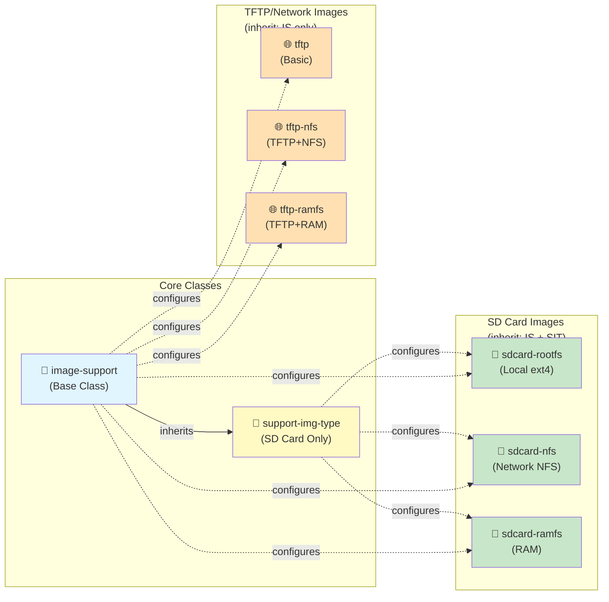
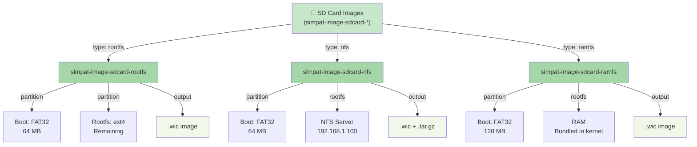
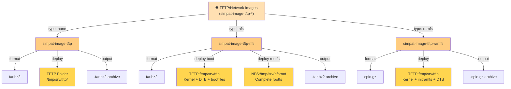
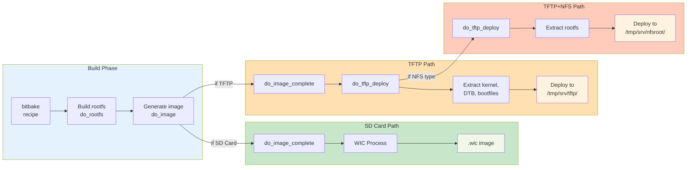
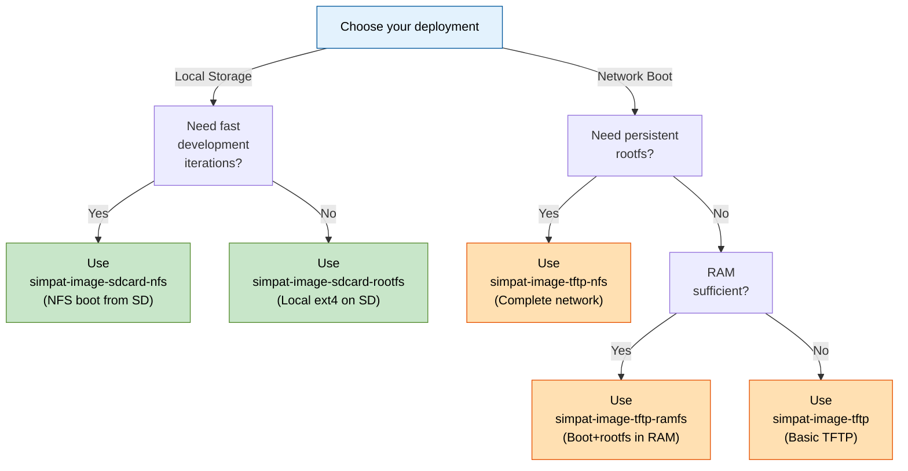

# Image Recipes Documentation

This document provides comprehensive documentation for the `meta-raspberrypi-simpat` layer's image recipes.

---

## Overview

The layer provides **6 image recipes** organized into two groups:

1. **SD Card Images** (3 recipes) - Local storage on SD card or eMMC
2. **TFTP/Network Images** (3 recipes) - Network deployment via TFTP/NFS

All recipes extend `core-image-minimal` from the Poky layer.

### Recipe and Class Relationships



---

## SD Card Image Recipes

SD Card recipes build `.wic` images that can be directly burned to SD cards. They inherit both `image-support` and `support-img-type` classes.

```
simpat-image-sdcard-*
├── simpat-image-sdcard-rootfs     (Local ext4 rootfs)
├── simpat-image-sdcard-nfs        (Rootfs via NFS)
└── simpat-image-sdcard-ramfs      (Rootfs in RAM)
```

### SD Card Image Types and Configurations



---

**Summary:** Raspberry Pi SD card image with local rootfs

**Purpose:** Standard SD card deployment with rootfs stored locally on the card

**File Location:** `recipes-core/images/simpat-image-sdcard-rootfs.bb`

#### Configuration

```bitbake
SUMMARY = "SIMPAT Raspberry Pi SD card image with local rootfs"
LICENSE = "MIT"

require recipes-core/images/core-image-minimal.bb
inherit image-support support-img-type

SUPPORT_IMG_TYPE = "rootfs"
SUPPORT_BOOT := "sdcard"
```

#### Output Artifacts

| Artifact | Size | Format | Use Case |
|----------|------|--------|----------|
| `.wic` | ~300-500 MB | WIC image | Burn directly to SD card: `dd if=image.wic of=/dev/sdX` |
| `.wic.bz2` | ~50-100 MB | Compressed WIC | Network transfer before burning |
| `.tar.gz` | ~100-200 MB | Tarball | Backup or rootfs inspection |

#### Partition Layout

```
SD Card (e.g., /dev/mmcblk0)
├─ Partition 1 (mmcblk0p1) - FAT32 - /boot - ~64 MB
│  └─ Kernel, DTB, bootloader files
└─ Partition 2 (mmcblk0p2) - ext4 - / - Remaining space
   └─ Linux rootfs (filesystem, libraries, binaries)
```

#### Boot Flow

1. Power on → Raspberry Pi EEPROM bootloader
2. EEPROM loads `bootcode.bin` and `start.elf` from boot partition
3. `start.elf` loads kernel and DTB
4. Kernel boots with: `root=/dev/mmcblk0p2 rw rootwait`
5. Rootfs mounted from ext4 partition

#### Customization Example

```bitbake
SUMMARY = "My Custom Raspberry Pi SD Card"
LICENSE = "MIT"

require recipes-core/images/core-image-minimal.bb
inherit image-support support-img-type

SUPPORT_IMG_TYPE = "rootfs"
SUPPORT_BOOT := "sdcard"

# Add custom packages
IMAGE_INSTALL:append = " \
    openssh \
    openssh-sftp-server \
    git \
    vim \
    htop \
    python3 \
"

# Increase rootfs size (in KB)
IMAGE_ROOTFS_SIZE = "1048576"

# Enable additional features
EXTRA_IMAGE_FEATURES = "ssh-server-openssh"
```

#### Build and Deploy

```bash
# Build the image
bitbake simpat-image-sdcard-rootfs

# Find the output
find tmp/deploy/images/$MACHINE -name "*.wic"

# Burn to SD card
sudo dd if=tmp/deploy/images/raspberrypi5-64/simpat-image-sdcard-rootfs-*.wic of=/dev/sdb bs=4M status=progress

# Eject and boot
```

---

### 2. `simpat-image-sdcard-nfs.bb`

**Summary:** Raspberry Pi SD card image with NFS-booted rootfs

**Purpose:** SD card for boot files only, rootfs mounted over network from NFS server

**File Location:** `recipes-core/images/simpat-image-sdcard-nfs.bb`

#### Use Cases

- **Development:** Shared rootfs across multiple Raspberry Pis
- **Live Development:** Modify rootfs on server without rebuilding image
- **Persistence:** NFS can be on persistent storage (RAID, backups)
- **Network Boot Testing:** Complete network boot scenario

#### Configuration

```bitbake
SUMMARY = "SIMPAT Raspberry Pi SD card boot image for NFS rootfs"
LICENSE = "MIT"

require recipes-core/images/core-image-minimal.bb
inherit image-support support-img-type

SUPPORT_BOOT := "sdcard"
SUPPORT_IMG_TYPE = "nfs"

IP_SERVER_NFS ?= "192.168.1.100"
FOLDER_NFS_SERVER ?= "/tmp/nfs/rootfs"

IMAGE_FSTYPES:append = " tar.gz"
```

#### Key Variables

| Variable | Default | Purpose |
|----------|---------|---------|
| `IP_SERVER_NFS` | "192.168.1.100" | IP address of NFS server |
| `FOLDER_NFS_SERVER` | "/tmp/nfs/rootfs" | Export folder on NFS server |
| `SUPPORT_IMG_TYPE` | "nfs" | Image type (nfs) |

#### Output Artifacts

| Artifact | Size | Format | Use Case |
|----------|------|--------|----------|
| `.wic` | ~50 MB | WIC image | Burn to SD card (boot only) |
| `.tar.gz` | ~100-200 MB | Tarball | Rootfs archive for extraction to NFS |

#### Partition Layout

```
SD Card (e.g., /dev/mmcblk0)
└─ Partition 1 (mmcblk0p1) - FAT32 - /boot - ~64 MB
   └─ Kernel, DTB, bootloader files

NFS Server (e.g., /srv/nfs/rpi5-rootfs)
├─ /bin, /sbin, /usr, /lib (Linux filesystem)
├─ /home (user directories)
├─ /var, /tmp (runtime directories)
└─ (all rootfs content)
```

#### Boot Flow

1. Power on → Raspberry Pi EEPROM bootloader
2. EEPROM loads boot files from SD card partition 1
3. Kernel boots with: `root=/dev/nfs nfsroot=192.168.1.100:/tmp/nfs/rootfs ...`
4. Rootfs mounted from NFS server
5. All rootfs I/O goes over ethernet network

#### NFS Server Setup

Before first boot, set up NFS server:

```bash
# Extract rootfs to NFS folder
mkdir -p /srv/nfs/rpi5-rootfs
sudo tar -xzf tmp/deploy/images/raspberrypi5-64/simpat-image-sdcard-nfs-*.tar.gz \
    -C /srv/nfs/rpi5-rootfs/

# Configure NFS export
echo "/srv/nfs/rpi5-rootfs 192.168.1.0/24(rw,sync,no_subtree_check,no_root_squash)" \
    | sudo tee -a /etc/exports

# Enable NFS export
sudo exportfs -ra

# Burn SD card with boot files
sudo dd if=tmp/deploy/images/raspberrypi5-64/simpat-image-sdcard-nfs-*.wic of=/dev/sdb bs=4M
```

#### Advantages

- **Fast Development Loop:** Modify files on NFS server, restart Pi without rebuilding
- **Shared Rootfs:** Multiple Pis can boot from same NFS export
- **Persistent Storage:** NFS can be on RAID or networked storage
- **No SD Card Size Limits:** Rootfs can be larger than SD card

#### Disadvantages

- **Network Dependency:** Pi must have network connectivity to boot
- **Performance:** Network I/O slower than local storage
- **NFS Server Required:** Need separate machine running NFS server

#### Customization Example

```bitbake
# Override NFS location
IP_SERVER_NFS = "192.168.1.50"
FOLDER_NFS_SERVER = "/mnt/nfs/production/rpi5"
```

---

### 3. `simpat-image-sdcard-ramfs.bb`

**Summary:** Raspberry Pi SD card image with bundled initramfs rootfs

**Purpose:** SD card with boot files only, rootfs bundled in kernel and loaded entirely into RAM

**File Location:** `recipes-core/images/simpat-image-sdcard-ramfs.bb`

#### Use Cases

- **Embedded Systems:** No network or NFS required
- **Read-Only Root:** Rootfs in RAM, modifications not persisted
- **Fast Boot:** Kernel boots faster (no rootfs initialization)
- **Kiosk/Appliances:** Single-purpose systems with fixed functionality

#### Configuration

```bitbake
SUMMARY = "SIMPAT Raspberry Pi SD card boot image for bundled initramfs"
LICENSE = "MIT"

require recipes-core/images/core-image-minimal.bb

SUPPORT_BOOT := "sdcard"
SUPPORT_IMG_TYPE := "ramfs"

inherit image-support support-img-type

INITRAMFS_IMAGE ?= "core-image-minimal-initramfs"
```

#### Key Variables

| Variable | Default | Purpose |
|----------|---------|---------|
| `SUPPORT_IMG_TYPE` | "ramfs" | Image type (ramfs) |
| `INITRAMFS_IMAGE` | "core-image-minimal-initramfs" | Initramfs image to bundle |
| `INITRAMFS_IMAGE_BUNDLE` | "1" | Bundle initramfs into kernel (automatic) |

#### Output Artifacts

| Artifact | Size | Format | Use Case |
|----------|------|--------|----------|
| `.wic` | ~150-250 MB | WIC image | Burn to SD card (includes bundled kernel) |
| Bundled Kernel | ~10-20 MB | ELF + initramfs | Kernel with initramfs included |

#### Partition Layout

```
SD Card (e.g., /dev/mmcblk0)
└─ Partition 1 (mmcblk0p1) - FAT32 - /boot - ~128 MB
   ├─ kernel_*.img (larger, includes initramfs)
   ├─ DTB
   └─ Bootloader files

RAM (During Boot)
└─ Complete Linux filesystem loaded from initramfs
   ├─ /bin, /sbin, /usr, /lib (in RAM)
   ├─ /home (in RAM, volatile)
   └─ All rootfs content (in RAM)
```

#### Boot Flow

1. Power on → Raspberry Pi EEPROM bootloader
2. EEPROM loads bundled kernel+initramfs from boot partition
3. Kernel extracts initramfs to RAM
4. Rootfs initialized entirely in RAM
5. All filesystem operations use RAM (very fast, volatile)

#### Special Characteristics

- **Boot Partition Size:** Set to 128 MB (larger than SD Card variants)
- **No Rootfs Device:** Kernel command-line has NO `root=` parameter
- **Volatile Changes:** Any modifications to rootfs are lost on reboot
- **RAM Required:** Rootfs size must fit in available RAM

#### Memory Requirements

The entire rootfs must fit in RAM. For Raspberry Pi 5 with 8 GB RAM:

- `core-image-minimal-initramfs` ≈ 50-80 MB
- Leave RAM for kernel and applications

#### Customization Example

```bitbake
SUMMARY = "RAMFS Kiosk Image"

require recipes-core/images/core-image-minimal.bb

SUPPORT_BOOT := "sdcard"
SUPPORT_IMG_TYPE := "ramfs"

inherit image-support support-img-type

# Use specific initramfs
INITRAMFS_IMAGE = "core-image-minimal-initramfs"

# Add specific packages to initramfs
IMAGE_INSTALL:append = " \
    myapp \
    browser \
    wifi-manager \
"

# Ensure sufficient boot partition (for larger bundled kernel)
SUPPORT_WIC_BOOT_PARTITION_SIZE = "256"
```

---

## TFTP/Network Image Recipes

TFTP recipes deploy boot files to a TFTP server and rootfs to NFS (or RAM for RAMFS). They inherit only the `image-support` class.

```
simpat-image-tftp-*
├── simpat-image-tftp          (Basic network boot)
├── simpat-image-tftp-nfs      (Network boot + NFS rootfs)
└── simpat-image-tftp-ramfs    (Network boot + RAM rootfs)
```

### TFTP Image Types and Deployments



---

**Summary:** Basic TFTP boot image with tar.bz2 rootfs

**Purpose:** Simplest network boot image with rootfs deployed as tar archive

**File Location:** `recipes-core/images/simpat-image-tftp.bb`

#### Configuration

```bitbake
SUMMARY = "SIMPAT Raspberry Pi TFTP netboot image"
LICENSE = "MIT"

IMAGE_FSTYPES = "tar.bz2"

require recipes-core/images/core-image-minimal.bb

SUPPORT_BOOT := "tftp"

inherit image-support

TFTP_BOOT_FOLDER ?= "/tmp/srv/tftp"
```

#### Key Variables

| Variable | Default | Purpose |
|----------|---------|---------|
| `SUPPORT_BOOT` | "tftp" | Boot type (tftp) |
| `TFTP_BOOT_FOLDER` | "/tmp/srv/tftp" | TFTP server folder for boot files |
| `IMAGE_FSTYPES` | "tar.bz2" | Image format (compressed tar) |

#### Output Artifacts

| Artifact | Size | Format | Location | Use Case |
|----------|------|--------|----------|----------|
| tar.bz2 | ~50-100 MB | Compressed archive | Deploy dir | Source for extraction |
| kernel | ~10 MB | Binary | `/tmp/srv/tftp/` | TFTP-served kernel |
| DTB | ~100 KB | Binary | `/tmp/srv/tftp/` | TFTP-served device tree |
| bootfiles | ~1 MB | Various | `/tmp/srv/tftp/` | TFTP-served bootloader files |

#### Deployment Flow

**Build Time:**
1. `bitbake simpat-image-tftp`
2. BitBake creates tar.bz2 rootfs archive
3. `do_tftp_deploy` task runs automatically
4. Extracts kernel, DTB, bootfiles from deploy directory
5. Copies to `/tmp/srv/tftp/`

**Boot Time:**
1. Bootloader via TFTP downloads kernel and DTB
2. Kernel boots (rootfs not yet loaded)
3. Initrd or rootfs mounting handled by bootloader/kernel script

#### Use Cases

- **Development:** Quick iteration without re-burning SD cards
- **CI/CD:** Automated testing of images
- **PXE Boot:** Legacy TFTP boot infrastructure

---

### 2. `simpat-image-tftp-nfs.bb`

**Summary:** TFTP boot image with NFS-mounted rootfs

**Purpose:** Complete network boot - kernel/DTB via TFTP, rootfs via NFS

**File Location:** `recipes-core/images/simpat-image-tftp-nfs.bb`

#### Configuration

```bitbake
SUMMARY = "SIMPAT Raspberry Pi TFTP/NFS netboot image"
DESCRIPTION = "TFTP boot image with NFS rootfs for complete network boot"
LICENSE = "MIT"

IMAGE_FSTYPES = "tar.bz2"

require recipes-core/images/core-image-minimal.bb

SUPPORT_BOOT := "tftp"
SUPPORT_IMG_TYPE := "nfs"

inherit image-support

TFTP_BOOT_FOLDER ?= "/tmp/srv/tftp"
FOLDER_NFS_SERVER ?= "/tmp/srv/nfsroot"

IP_SERVER_NFS ?= "192.168.1.100"

IMAGE_INSTALL:append = " \
    kernel-modules \
    udev \
    base-files \
    base-passwd \
    netbase \
    openssh \
    openssh-sftp-server \
"

DISTRO_FEATURES:append = " systemd"
VIRTUAL-RUNTIME_init_manager = "systemd"
EXTRA_IMAGE_FEATURES:append = " ssh-server-openssh"
```

#### Key Variables

| Variable | Default | Purpose |
|----------|---------|---------|
| `SUPPORT_BOOT` | "tftp" | Boot type (tftp) |
| `SUPPORT_IMG_TYPE` | "nfs" | Image type (nfs - rootfs via NFS) |
| `TFTP_BOOT_FOLDER` | "/tmp/srv/tftp" | TFTP server folder for boot files |
| `FOLDER_NFS_SERVER` | "/tmp/srv/nfsroot" | NFS server folder for rootfs |
| `IP_SERVER_NFS` | "192.168.1.100" | NFS server IP address |

#### Output Artifacts

Both boot files AND rootfs are deployed:

| Component | Location | Purpose |
|-----------|----------|---------|
| Boot Files | `/tmp/srv/tftp/` | Kernel, DTB, bootloader (TFTP-served) |
| Rootfs | `/tmp/srv/nfsroot/` | Complete Linux filesystem (NFS-served) |

#### Deployment Flow

**Build Time:**
1. `bitbake simpat-image-tftp-nfs`
2. BitBake creates tar.bz2 rootfs archive
3. `do_tftp_deploy` task runs automatically
   - Extracts and copies boot files to `/tmp/srv/tftp/`
   - Extracts rootfs tar.bz2 to `/tmp/srv/nfsroot/`
4. Both TFTP and NFS are now populated

**Boot Time:**
1. Bootloader via TFTP downloads kernel and DTB
2. Kernel boots with command line: `root=/dev/nfs nfsroot=192.168.1.100:/tmp/srv/nfsroot`
3. Kernel mounts rootfs from NFS server over ethernet
4. Complete Linux system boots from network

#### Advantages

- **Complete Network Boot:** No local storage required on Pi
- **Live Modification:** Change rootfs on server without rebuilding
- **Multiple Pis:** Share same rootfs export across multiple boards
- **Infrastructure Support:** Works with existing TFTP/NFS infrastructure

#### Server Setup

```bash
# Create NFS export folder
mkdir -p /tmp/srv/nfsroot

# After bitbake build, NFS folder is auto-populated
# (do_tftp_deploy extracts rootfs there)

# Configure NFS export (if not auto-configured)
echo "/tmp/srv/nfsroot *(rw,sync,no_subtree_check,no_root_squash)" | sudo tee -a /etc/exports
sudo exportfs -ra

# Verify
sudo showmount -e localhost
```

#### Advanced Example

```bitbake
SUMMARY = "Production TFTP/NFS Boot Image"

require recipes-core/images/core-image-minimal.bb

SUPPORT_BOOT := "tftp"
SUPPORT_IMG_TYPE := "nfs"

inherit image-support

# Point to production server
IP_SERVER_NFS = "10.0.0.50"
FOLDER_NFS_SERVER = "/export/production/rpi5-rootfs"

# Production packages
IMAGE_INSTALL:append = " \
    openssh-server \
    openssh-client \
    git \
    htop \
    less \
    strace \
    iptables-legacy \
    netcat-openbsd \
"

# Enable network stack
DISTRO_FEATURES:append = " systemd ipv4 ipv6"
```

---

### 3. `simpat-image-tftp-ramfs.bb`

**Summary:** TFTP boot image with bundled initramfs rootfs

**Purpose:** Network boot (TFTP) with rootfs entirely in RAM (no NFS server needed)

**File Location:** `recipes-core/images/simpat-image-tftp-ramfs.bb`

#### Configuration

```bitbake
SUMMARY = "SIMPAT Raspberry Pi TFTP boot image with RAMFS rootfs"
DESCRIPTION = "TFTP netboot image with initramfs loaded entirely in RAM"
LICENSE = "MIT"

IMAGE_FSTYPES = "cpio.gz"

SUPPORT_BOOT := "tftp"
SUPPORT_IMG_TYPE := "ramfs"

require recipes-core/images/core-image-minimal.bb

inherit image-support

TFTP_BOOT_FOLDER ?= "/tmp/srv/tftp"

INITRAMFS_IMAGE = "core-image-minimal-initramfs"
KERNEL_IMAGETYPE = "Image"

# Minimal packages for RAMFS boot
IMAGE_INSTALL:append = " \
    base-files \
    base-passwd \
    bash \
    coreutils \
    grep \
    sed \
    findutils \
    udev \
    openssh \
    openssh-sftp-server \
"

DISTRO_FEATURES:append = " systemd"
VIRTUAL-RUNTIME_init_manager = "systemd"

IMAGE_ROOTFS_SIZE = "32768"

EXTRA_IMAGE_FEATURES:append = " ssh-server-openssh"
```

#### Key Variables

| Variable | Default | Purpose |
|----------|---------|---------|
| `SUPPORT_BOOT` | "tftp" | Boot type (tftp) |
| `SUPPORT_IMG_TYPE` | "ramfs" | Image type (ramfs - rootfs in RAM) |
| `TFTP_BOOT_FOLDER` | "/tmp/srv/tftp" | TFTP server folder |
| `INITRAMFS_IMAGE` | "core-image-minimal-initramfs" | Initramfs image |
| `IMAGE_FSTYPES` | "cpio.gz" | Image format (cpio gzip) |
| `IMAGE_ROOTFS_SIZE` | "32768" | Rootfs size (KB) for RAM allocation |

#### Output Artifacts

| Artifact | Size | Format | Location | Purpose |
|----------|------|--------|----------|---------|
| bundled kernel | ~15-25 MB | Binary + cpio | `/tmp/srv/tftp/` | Kernel + initramfs (TFTP-served) |
| DTB | ~100 KB | Binary | `/tmp/srv/tftp/` | Device tree (TFTP-served) |

#### Deployment Flow

**Build Time:**
1. `bitbake simpat-image-tftp-ramfs`
2. BitBake creates cpio.gz initramfs
3. Bundles initramfs into kernel
4. `do_tftp_deploy` task runs automatically
   - Copies bundled kernel + DTB to `/tmp/srv/tftp/`
5. No rootfs extraction (everything in kernel)

**Boot Time:**
1. Bootloader via TFTP downloads bundled kernel+initramfs and DTB
2. Kernel boots with initramfs loaded in memory
3. No rootfs mounting needed
4. Complete Linux system runs in RAM

#### Characteristics

- **Fastest Boot:** Minimal initialization, no rootfs mounting
- **No Network Needed:** After kernel loads, no network access required
- **Temporary Filesystem:** Changes not persisted across reboots
- **Size Constraint:** Entire rootfs must fit in RAM

#### RAM Requirements

- **kernel + initramfs:** ~20 MB
- **Rootfs (default):** ~32 MB
- **Total minimum RAM:** ~64 MB (comfortable with 256 MB+)
- **Raspberry Pi 5:** 4 GB+ available, plenty of room

#### Use Cases

- **Factory Testing:** Boot into test image without persistence
- **Embedded Kiosk:** Single-purpose app running from RAM
- **Disaster Recovery:** Boot to known-good rootfs for repairs
- **Offline Demo:** Boot without network access

#### Customization Example

```bitbake
SUMMARY = "TFTP Test/Demo Image"

require recipes-core/images/core-image-minimal.bb

SUPPORT_BOOT := "tftp"
SUPPORT_IMG_TYPE := "ramfs"

inherit image-support

# Add diagnostics tools
IMAGE_INSTALL:append = " \
    lmbench \
    bonnie++ \
    iperf3 \
    ethtool \
    busybox-extra \
    strace \
"

# Larger rootfs for test tools
IMAGE_ROOTFS_SIZE = "65536"
```

---

## Comparison Table

Quick reference for choosing the right recipe:

| Recipe | Storage | Boot | Rootfs | Network | Persistence | Speed | Use Case |
|--------|---------|------|--------|---------|-------------|-------|----------|
| `sdcard-rootfs` | SD Card | Local | ext4 on SD | Optional | Yes ✓ | Medium | Standard deployment |
| `sdcard-nfs` | SD Card | Local | NFS server | Required ✓ | Yes ✓ | Fast | Shared development |
| `sdcard-ramfs` | SD Card | Bundled | RAM | Optional | No ✗ | Fastest | Kiosk/appliances |
| `tftp` | TFTP | Network | tar | Required ✓ | (depends) | Medium | Legacy TFTP boot |
| `tftp-nfs` | TFTP+NFS | Network | NFS | Required ✓ | Yes ✓ | Fast | Full network boot |
| `tftp-ramfs` | TFTP | Network | RAM | Required ✓ (only boot) | No ✗ | Fastest | Network test/demo |

### Build and Deployment Flow



---

## Recipe Selection Guide

### Decision Tree: Which Recipe to Use?



---

## Creating Custom Recipes

### Template: Custom SD Card Image

```bitbake
SUMMARY = "My Custom SD Card Image"
DESCRIPTION = "Custom Raspberry Pi SD card with specific packages"
LICENSE = "MIT"

require recipes-core/images/core-image-minimal.bb
inherit image-support support-img-type

# Choose image type: rootfs, nfs, or ramfs
SUPPORT_BOOT := "sdcard"
SUPPORT_IMG_TYPE = "rootfs"

# For NFS type, configure server
# IP_SERVER_NFS = "192.168.1.100"
# FOLDER_NFS_SERVER = "/srv/nfs/rootfs"

# Add custom packages
IMAGE_INSTALL:append = " \
    openssh-server \
    git \
    python3 \
    myapp \
"

# Add features
EXTRA_IMAGE_FEATURES = "ssh-server-openssh"

# Configure size limits
IMAGE_ROOTFS_SIZE = "1048576"
```

### Template: Custom TFTP Image

```bitbake
SUMMARY = "My Custom TFTP Network Boot Image"
LICENSE = "MIT"

IMAGE_FSTYPES = "tar.bz2"

require recipes-core/images/core-image-minimal.bb
inherit image-support

# TFTP boot
SUPPORT_BOOT := "tftp"

# Choose rootfs type: standard, nfs, or ramfs
# For NFS:
# SUPPORT_IMG_TYPE := "nfs"
# IP_SERVER_NFS = "192.168.1.100"
# FOLDER_NFS_SERVER = "/srv/nfs/rootfs"

TFTP_BOOT_FOLDER = "/tmp/srv/tftp"

# Add custom packages
IMAGE_INSTALL:append = " \
    openssh \
    git \
    myapp \
"
```

---

## Debugging Recipes

### List all available image recipes

```bash
cd $YOCTO_BUILD_DIR
bitbake-layers show-recipes | grep simpat-image
```

### Show recipe configuration

```bash
bitbake -e simpat-image-tftp-nfs | grep -E "^(SUPPORT_|TFTP_|IMAGE_)"
```

### Build specific image

```bash
bitbake simpat-image-sdcard-rootfs

# Build only without deploying
bitbake -c compile simpat-image-sdcard-rootfs

# Clean and rebuild
bitbake -c cleanall simpat-image-sdcard-rootfs
bitbake simpat-image-sdcard-rootfs
```

### Check build artifacts

```bash
ls -lah tmp/deploy/images/$MACHINE/simpat-image-*
```

### Verify TFTP deployment

```bash  
# Check if do_tftp_deploy ran
bitbake -c do_tftp_deploy simpat-image-tftp-nfs

# List deployed files
ls -lah /tmp/srv/tftp/
ls -lah /tmp/srv/nfsroot/
```

---

## See Also

- [README-CLASS.md](../../classes/README-CLASS.md) - Classes documentation
- [README.md](../../README.md) - Main layer documentation
- Yocto Project Manual: https://docs.yoctoproject.org/
