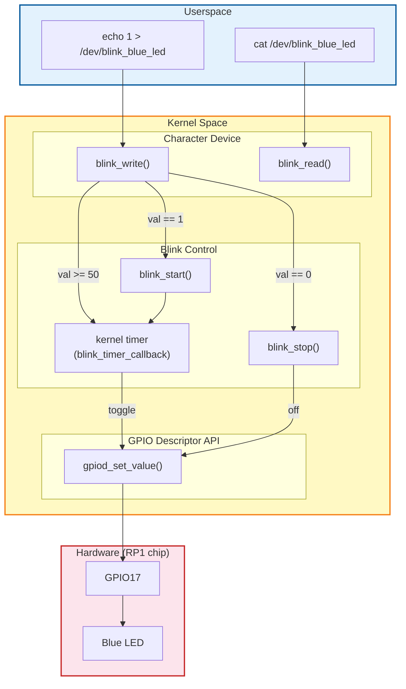
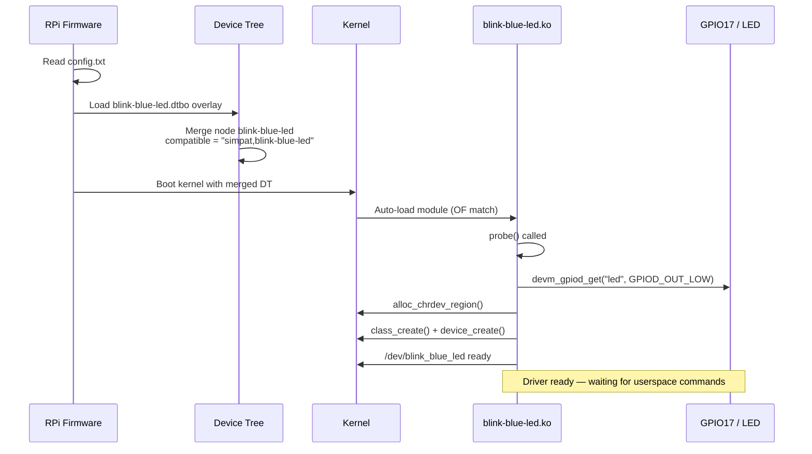
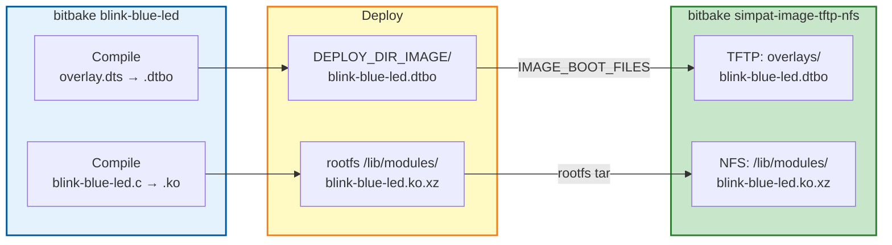

# blink-blue-led — Linux Kernel Driver for GPIO17 LED

Linux kernel module (platform driver) to blink a blue LED connected to **GPIO17** on Raspberry Pi 5.
Uses the modern **gpiod descriptor API** with a **Device Tree overlay** for proper RP1 chip GPIO resolution.

---

## Hardware Circuit

```
GPIO17 (pin 11) ──── R1 (220Ω) ──── LED (Blue 525nm) ──── GND
```

| Component | Value | Role |
|-----------|-------|------|
| GPIO17 | BCM pin 17 (physical pin 11) | Digital output |
| R1 | 220Ω | Current limiting resistor |
| LED1 | Blue (525nm) | Indicator |
| GND | Ground | Return path |

---

## Architecture

### Driver Architecture



### Boot & Probe Flow



### Yocto Build & Deploy Flow



---

## Files

| File | Description |
|------|-------------|
| `blink-blue-led.bb` | Yocto recipe — builds kernel module + DT overlay, deploys to TFTP |
| `files/blink-blue-led.c` | Platform driver source (gpiod API, char device, kernel timer) |
| `files/blink-blue-led-overlay.dts` | Device Tree overlay — declares GPIO17 for the driver |
| `files/Makefile` | Kernel module build Makefile |

---

## Device Tree Overlay

The overlay declares GPIO17 on the RP1 controller for our driver:

```dts
/ {
    compatible = "brcm,bcm2712";       /* RPi 5 SoC */
    fragment@0 {
        target-path = "/";
        __overlay__ {
            blink-blue-led {
                compatible = "simpat,blink-blue-led";  /* matches driver */
                led-gpios = <&gpio 17 0>;              /* GPIO17 active-high */
                status = "okay";
            };
        };
    };
};
```

The `compatible` string links the DT node to the kernel driver's `of_match_table`.

---

## Usage

### Build

```bash
# Build only the driver
bitbake blink-blue-led

# Build full image (includes driver + overlay + TFTP deploy)
bitbake simpat-image-tftp-nfs
```

### Control on target

```bash
# Start blinking (default 500ms period)
echo 1 > /dev/blink_blue_led

# Check status
cat /dev/blink_blue_led
# → "blinking 500"

# Change blink period to 200ms
echo 200 > /dev/blink_blue_led

# Stop blinking (LED off)
echo 0 > /dev/blink_blue_led

# Check status
cat /dev/blink_blue_led
# → "off"
```

### Module parameter

```bash
# Load with custom default period (1 second)
modprobe blink_blue_led blink_period_ms=1000

# Change at runtime via sysfs
echo 250 > /sys/module/blink_blue_led/parameters/blink_period_ms
```

### Diagnostics

```bash
# Check module is loaded
lsmod | grep blink

# Check dmesg for driver messages
dmesg | grep blink_blue_led

# Verify device node
ls -la /dev/blink_blue_led

# Check DT overlay was applied
ls /proc/device-tree/blink-blue-led/
```

---

## Chardev Interface

| Write | Action |
|-------|--------|
| `0` | Stop blinking, LED off |
| `1` | Start blinking with current period |
| `50`–`10000` | Set blink period in ms |

| Read | Output |
|------|--------|
| Blinking | `blinking <period_ms>\n` |
| Stopped | `off\n` |

---

## Key Design Choices

| Aspect | Choice | Reason |
|--------|--------|--------|
| GPIO API | `gpiod_*` (descriptor) | RPi 5 RP1 chip requires DT-based GPIO resolution |
| Driver model | Platform driver + DT overlay | Auto-probe at boot, no manual `insmod` needed |
| Timer | `timer_list` (kernel software timer) | Simple periodic toggle, no need for hrtimer |
| Char device | Manual `cdev` + `class_create` | Full control over `/dev/` node and permissions |
| Resource mgmt | `devm_gpiod_get()` | Automatic GPIO release on driver removal |
