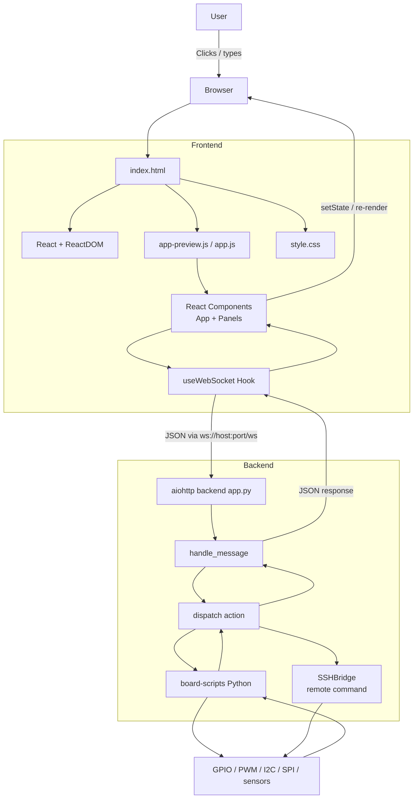
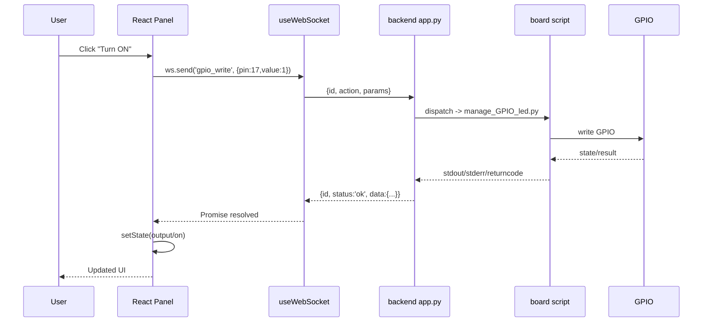

# Beginner Guide: How Your Frontend Is Built

This document explains, in simple words, how the frontend page works in this project, and how it communicates with the Python backend.

## 1) Overview

Your application is a single-page web app (SPA) based on 4 main files:

- `files/frontend/index.html`
- `files/frontend/style.css`
- `files/frontend/app-preview.js` (and also `app.js` for production)
- `files/backend/app.py`

Key idea:

1. HTML provides a mounting point (`<div id="root"></div>`).
2. JavaScript (React) builds the full interface dynamically.
3. CSS provides visual styling.
4. User actions send WebSocket messages to the Python backend.
5. The backend executes hardware scripts and sends responses back to the frontend.

## 2) Mermaid Graph (full architecture)



## 3) How the page is built (HTML + JS + React)

### 3.1 HTML role

In `index.html`, there is almost no UI content:

- A `<div id="root"></div>`
- React scripts
- Your app script (`app-preview.js`)

HTML is the base container. It only prepares where React will draw the interface.

### 3.2 JavaScript role

In `app-preview.js`:

- `const { useState, useEffect, useRef, useCallback } = React;`
- `const h = React.createElement;`

Here you use React without JSX compilation. So instead of writing:

`<button>Apply</button>`

you write:

`h('button', { ... }, 'Apply')`

### 3.3 Entry point

At the end of the file:

- `const root = ReactDOM.createRoot(document.getElementById('root'));`
- `root.render(h(App));`

Simple translation:

1. Find HTML node `#root`.
2. Mount main component `App` into it.
3. React controls that area.

### 3.4 App component

`App()` is the orchestrator:

- Builds WebSocket URL: `ws://<host>:<port>/ws`
- Creates connection via `useWebSocket(...)`
- Stores global state (`activePanel`, `sshConnected`, `showDebug`)
- Renders:
  - left sidebar (navigation)
  - center panel (active component)
  - right panel (SSH + system info + terminal)

### 3.5 Panel components

Each hardware module has its own component:

- `BlueLedPanel`
- `ServoPanel`
- `DhtPanel`
- `GpioPanel`
- etc.

A panel usually follows this pattern:

1. Local state (`useState`): UI values, results, errors.
2. User event (`onClick`, `onChange`).
3. Network call via `await ws.send('action', params)`.
4. Update state with `setOutput`, `setData`, etc.
5. React re-renders automatically.

## 4) How JavaScript interacts with HTML

Think of it this way:

- Initial HTML is static and minimal.
- React builds a virtual tree in memory.
- When state changes (`setState`), React compares old/new trees.
- React updates only required parts of the real DOM.

Concrete example:

1. You move an RGB slider.
2. `onChange` calls `setR(...)`.
3. React recalculates component rendering.
4. Color preview style updates in the DOM.
5. If you click Apply, a WebSocket command is sent.

## 5) How backend interacts with JS / React

## 5.1 Message protocol

Frontend sends JSON like:

```json
{
  "id": "42",
  "action": "gpio_write",
  "params": { "pin": 17, "value": 1 }
}
```

Backend returns JSON like:

```json
{
  "type": "response",
  "id": "42",
  "action": "gpio_write",
  "status": "ok",
  "data": { "stdout": "...", "stderr": "...", "returncode": 0 }
}
```

Field `id` matches each response to its request.

## 5.2 Frontend side: `useWebSocket`

The `useWebSocket` hook:

- Opens/closes connection (`connect`, `disconnect`)
- Tracks connection state (`ready`)
- Stores callbacks map (`cbMap`) indexed by `id`
- Adds logs for Debug Console
- Handles timeout (30 s)

So when a panel calls `ws.send(...)`, it gets a Promise resolved when the response with the same `id` arrives.

## 5.3 Backend side: `app.py`

In `app.py`:

1. `websocket_handler` receives text WebSocket messages.
2. `handle_message` reads `action`, `params`, `id`.
3. `dispatch(action, params)` routes to the correct command.
4. Backend runs scripts (`manage_GPIO_led.py`, `servo_control.py`, etc.).
5. Result is wrapped and sent back to the frontend.

## 5.4 Full flow example (LED click)



## 6) Why React is useful here

Without React, you would have to:

- manipulate DOM manually (`document.querySelector`, `innerHTML`, etc.)
- manage state yourself
- keep data and UI in sync manually

With React:

- state is centralized (`useState`)
- UI is a function of state
- updates are predictable

## 7) Difference between app-preview.js and app.js

- `app-preview.js`: preview/testing oriented version, no JSX build step (uses `h(...)`).
- `app.js`: main production version (uses JSX syntax in this repo).
- Both use the same architecture idea: React components + WebSocket hook + backend actions.

## 8) Ultra-short summary

1. HTML provides only `#root`.
2. JS/React builds all UI in that root.
3. User actions often trigger `ws.send(action, params)`.
4. Python backend receives, routes, and runs script/SSH command.
5. Response comes back in JSON.
6. React updates UI automatically through state.

## 9) Fast learning path (beginner)

Recommended reading order:

1. `files/frontend/index.html`
2. `files/frontend/app-preview.js`:
   - `useWebSocket`
   - `App`
   - one simple panel (`BlueLedPanel`)
3. `files/backend/app.py`:
   - `websocket_handler`
   - `handle_message`
   - `dispatch`

If you understand these 3 blocks, you already understand about 80% of the project architecture.
