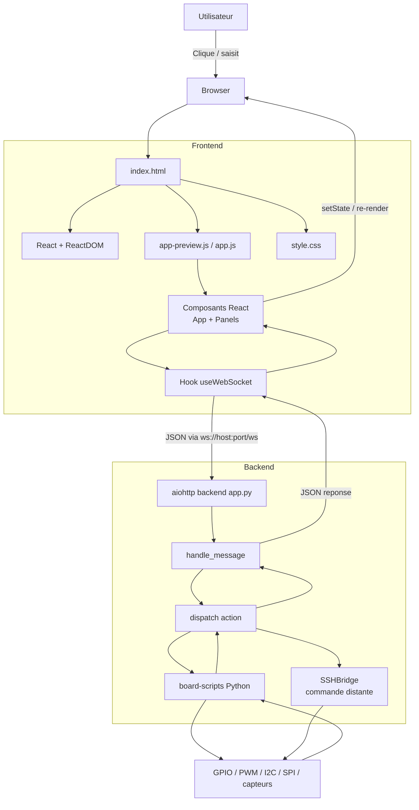
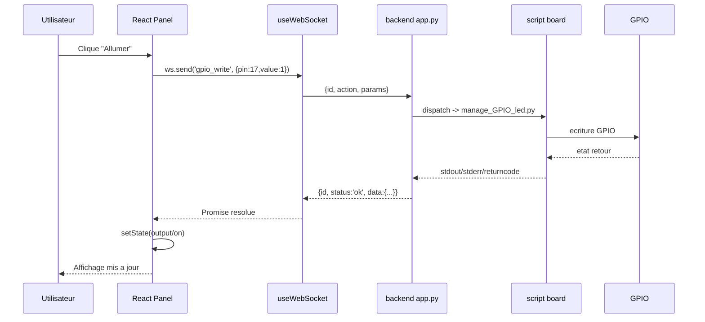

# Explication Debutant: Comment Ton Frontend Est Construit

Ce document explique, avec des mots simples, comment la page frontend fonctionne dans ce projet, puis comment elle communique avec le backend Python.

## 1) Vue d'ensemble

Ton application est une page web unique (SPA) qui repose sur 4 fichiers principaux:

- `files/frontend/index.html`
- `files/frontend/style.css`
- `files/frontend/app-preview.js` (et aussi `app.js` pour la version production)
- `files/backend/app.py`

Idee cle:

1. HTML fournit un point de montage (`<div id="root"></div>`).
2. JavaScript (React) construit toute l'interface dynamiquement.
3. CSS donne le style visuel.
4. Les actions utilisateur envoient des messages WebSocket au backend Python.
5. Le backend execute des scripts materiels, puis renvoie la reponse au frontend.

## 2) Graph Mermaid (architecture complete)



## 3) Comment la page est construite (HTML + JS + React)

### 3.1 Le role du HTML

Dans `index.html`, tu as presque "rien" visuellement:

- Un `<div id="root"></div>`
- Les scripts React
- Le script de ton application (`app-preview.js`)

Le HTML agit comme "socle". Il prepare juste l'endroit ou React va dessiner l'interface.

### 3.2 Le role du JavaScript

Dans `app-preview.js`:

- `const { useState, useEffect, useRef, useCallback } = React;`
- `const h = React.createElement;`

Ici, tu utilises React sans JSX compile. Donc au lieu d'ecrire:

`<button>Appliquer</button>`

tu ecris:

`h('button', { ... }, 'Appliquer')`

### 3.3 Le point d'entree

A la fin du fichier:

- `const root = ReactDOM.createRoot(document.getElementById('root'));`
- `root.render(h(App));`

Traduction simple:

1. Trouve le noeud HTML `#root`.
2. Monte le composant principal `App` dedans.
3. React prend la main sur cette zone.

### 3.4 Le composant App

`App()` est l'orchestrateur:

- Construit l'URL WebSocket: `ws://<host>:<port>/ws`
- Cree la connexion via `useWebSocket(...)`
- Garde des etats globaux (`activePanel`, `sshConnected`, `showDebug`)
- Affiche:
  - une sidebar (navigation)
  - un panneau central (composant actif)
  - un panneau droit (SSH + infos systeme + terminal)

### 3.5 Les composants "Panel"

Chaque materiel a son composant:

- `BlueLedPanel`
- `ServoPanel`
- `DhtPanel`
- `GpioPanel`
- etc.

Un panel suit souvent ce schema:

1. Etats locaux (`useState`): valeurs UI, resultats, erreurs.
2. Evenement utilisateur (`onClick`, `onChange`).
3. Appel reseau via `await ws.send('action', params)`.
4. Mise a jour de l'etat avec `setOutput`, `setData`, etc.
5. React re-render automatiquement.

## 4) Comment JavaScript interagit avec le HTML

Pense a ceci:

- HTML initial: statique et minimal.
- React: cree un "arbre virtuel" en memoire.
- Quand un etat change (`setState`), React compare ancien/nouvel arbre.
- React met a jour uniquement les parties necessaires du DOM reel.

Exemple concret:

1. Tu deplaces un slider RGB.
2. `onChange` appelle `setR(...)`.
3. React recalcule le rendu du composant.
4. Le style du preview couleur est mis a jour dans le DOM.
5. Si tu cliques "Appliquer", une commande WebSocket est envoyee.

## 5) Comment le backend interagit avec JS / React

## 5.1 Le protocole de message

Le frontend envoie un JSON comme:

```json
{
  "id": "42",
  "action": "gpio_write",
  "params": { "pin": 17, "value": 1 }
}
```

Le backend renvoie un JSON comme:

```json
{
  "type": "response",
  "id": "42",
  "action": "gpio_write",
  "status": "ok",
  "data": { "stdout": "...", "stderr": "...", "returncode": 0 }
}
```

Le champ `id` permet de faire correspondre requete et reponse.

## 5.2 Cote frontend: `useWebSocket`

Le hook `useWebSocket`:

- Ouvre/ferme la connexion (`connect`, `disconnect`)
- Gere l'etat de connexion (`ready`)
- Gere une map des callbacks (`cbMap`) indexee par `id`
- Ajoute des logs pour la Debug Console
- Gere un timeout (30 s)

Donc quand un panel appelle `ws.send(...)`, il recoit une Promise resolue quand la reponse avec le meme `id` revient.

## 5.3 Cote backend: `app.py`

Dans `app.py`:

1. `websocket_handler` recoit les messages texte WebSocket.
2. `handle_message` lit `action`, `params`, `id`.
3. `dispatch(action, params)` route vers la bonne commande.
4. Le backend lance des scripts (`manage_GPIO_led.py`, `servo_control.py`, etc.).
5. Le resultat est encapsule et renvoye au frontend.

## 5.4 Exemple complet de flux (clic LED)



## 6) Pourquoi React ici est pratique

Sans React, tu devrais:

- manipuler le DOM a la main (`document.querySelector`, `innerHTML`, etc.)
- maintenir les etats toi-meme
- synchroniser affichage et donnees manuellement

Avec React:

- l'etat est central (`useState`)
- l'UI est une fonction de l'etat
- les updates d'interface sont predictibles

## 7) Difference app-preview.js vs app.js

- `app-preview.js`: version orientee preview/tests rapides et structure sans JSX (avec `h(...)`).
- `app.js`: version production principale (avec syntaxe JSX dans ce repo).
- Les deux suivent la meme architecture logique: composants React + hook WebSocket + actions backend.

## 8) Resume ultra-court

1. HTML pose juste `#root`.
2. JS/React construit tout l'ecran dans ce root.
3. Chaque action utilisateur declenche souvent `ws.send(action, params)`.
4. Le backend Python recoit, route, execute script/SSH.
5. La reponse revient en JSON.
6. React met a jour l'interface automatiquement via l'etat.

## 9) Pour progresser vite (debutant)

Ordre conseille pour lire le code:

1. `files/frontend/index.html`
2. `files/frontend/app-preview.js`:
   - `useWebSocket`
   - `App`
   - un panel simple (`BlueLedPanel`)
3. `files/backend/app.py`:
   - `websocket_handler`
   - `handle_message`
   - `dispatch`

Si tu comprends ces 3 blocs, tu comprends deja 80% de l'architecture du projet.
