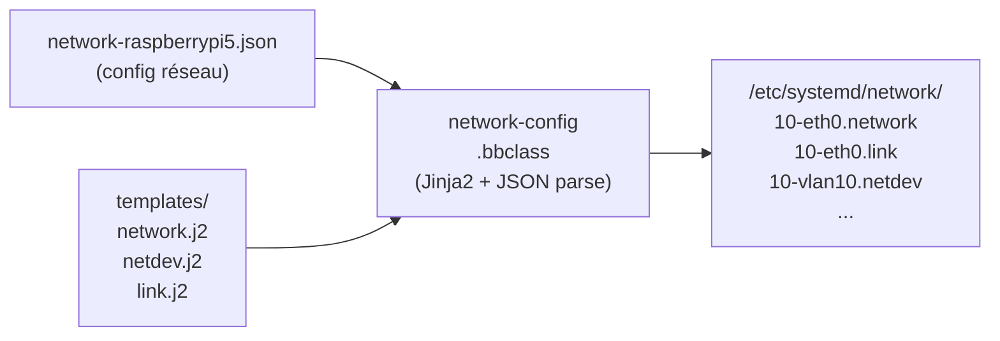
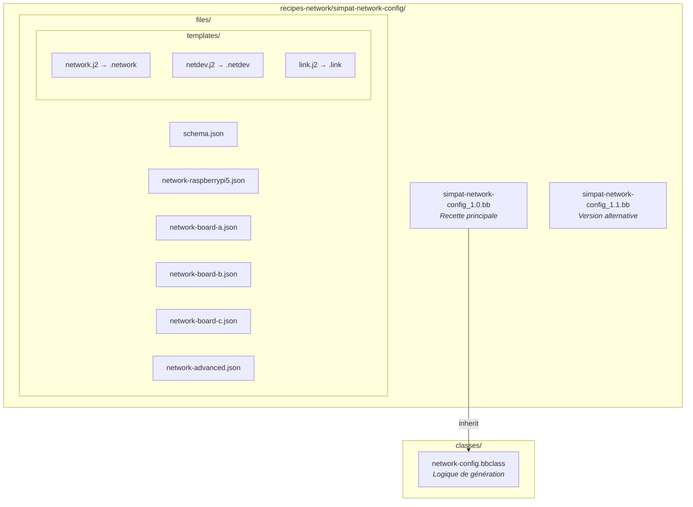
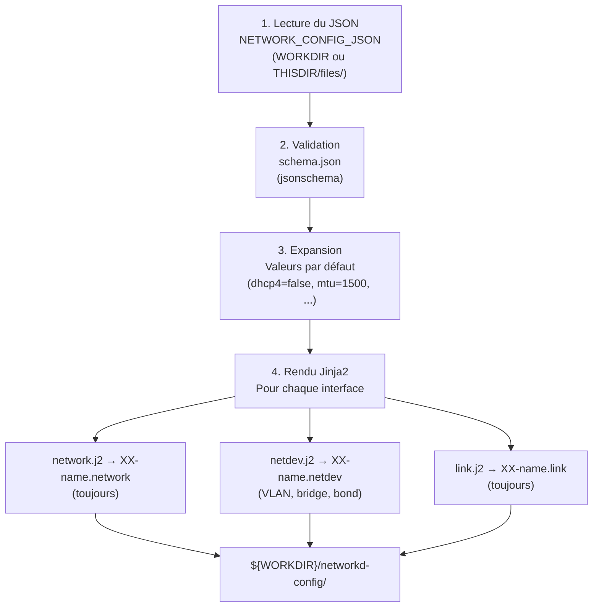
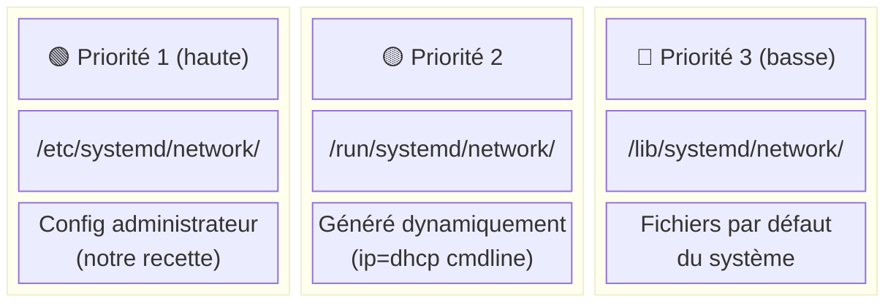

# simpat-network-config — Documentation

## Vue d'ensemble

La recette `simpat-network-config` génère automatiquement des fichiers de configuration **systemd-networkd** (`.network`, `.netdev`, `.link`) à partir de fichiers JSON descriptifs et de templates Jinja2. Elle s'appuie sur la classe `network-config.bbclass`.



---

## Architecture des fichiers



---

## Fonctionnement détaillé

### 1. La recette (`simpat-network-config_1.0.bb`)

La recette déclare :

- **`SRC_URI`** : les fichiers sources (templates, JSON, schéma) récupérés dans `files/`
- **`NETWORK_CONFIG_JSON`** : sélection du fichier JSON selon la `MACHINE` cible
- **`inherit network-config`** : délègue la génération à la bbclass

```bitbake
# Sélection par MACHINE (override BitBake)
NETWORK_CONFIG_JSON:raspberrypi5 = "network-raspberrypi5.json"
NETWORK_CONFIG_JSON:board-a = "network-board-a.json"
NETWORK_CONFIG_JSON ?= ""   # Vide par défaut → pas de génération
```

> **Important** : `PACKAGE_ARCH = "${MACHINE_ARCH}"` garantit un package spécifique par machine.

### 2. La classe (`network-config.bbclass`)

La bbclass fournit deux tâches BitBake :

#### `do_generate_networkd_config` (Python)

Exécutée **avant** `do_install`. Pipeline :



Les fichiers sont générés dans `${WORKDIR}/networkd-config/` avec un index démarrant à `10`.

#### `do_install` (Shell)

Copie les fichiers générés vers :

```
${D}${sysconfdir}/systemd/network/   →   /etc/systemd/network/
```

### 3. Priorité systemd-networkd



Notre fichier `10-eth0.network` dans `/etc/` a la priorité la plus haute et sera toujours appliqué.

---

## Format du JSON de configuration

### Structure minimale

```json
{
  "version": "1.0",
  "hostname": "raspberrypi5",
  "interfaces": [
    {
      "name": "eth0",
      "kind": "ethernet"
    }
  ]
}
```

### Propriétés d'une interface

| Propriété | Type | Défaut | Description |
|-----------|------|--------|-------------|
| `name` | string | *requis* | Nom de l'interface (`eth0`, `vlan10`, `br0`) |
| `kind` | string | `ethernet` | Type : `ethernet`, `vlan`, `bridge`, `bond`, `loopback` |
| `dhcp4` | bool | `false` | Activer DHCPv4 |
| `dhcp6` | bool | `false` | Activer DHCPv6 |
| `ipv4` | string[] | — | Adresses IPv4 statiques (notation CIDR : `192.168.10.22/24`) |
| `ipv6` | string[] | — | Adresses IPv6 statiques |
| `gateway4` | string | — | Passerelle IPv4 par défaut |
| `gateway6` | string | — | Passerelle IPv6 par défaut |
| `mtu` | int | `1500` | MTU (68–65535) |
| `dns` | string[] | — | Serveurs DNS |
| `dns_search` | string[] | — | Domaines de recherche DNS |
| `ntp` | string[] | — | Serveurs NTP |
| `multicast` | bool | `true` | Activer le multicast |
| `arp` | bool | `true` | Activer ARP |
| `promiscuous` | bool | `false` | Mode promiscuous |
| `routes` | object[] | — | Routes statiques additionnelles |

### Propriétés spécifiques par type

**VLAN** (`kind: "vlan"`) :

| Propriété | Description |
|-----------|-------------|
| `id` | VLAN ID (1–4094) |
| `link` | Interface parente (ex: `eth0`) |

**Bridge** (`kind: "bridge"`) :

| Propriété | Description |
|-----------|-------------|
| `members` | Liste des interfaces membres |
| `stp` | Activer Spanning Tree Protocol |
| `forward_delay` | Délai de forwarding (secondes) |
| `hello_time` | Intervalle hello STP |
| `max_age` | Âge maximum STP |

**Bond** (`kind: "bond"`) :

| Propriété | Description |
|-----------|-------------|
| `members` | Liste des interfaces membres |
| `mode` | Mode : `balance-rr`, `active-backup`, `balance-xor`, `broadcast`, `802.3ad`, `balance-tlb`, `balance-alb` |
| `miimon` | Intervalle de monitoring MII (ms, défaut: 100) |
| `downdelay` | Délai down (ms) |
| `updelay` | Délai up (ms) |
| `primary` | Interface primaire (mode active-backup) |

---

## Exemples de configuration

### IP statique (Raspberry Pi 5)

```json
{
  "version": "1.0",
  "hostname": "raspberrypi5",
  "interfaces": [
    {
      "name": "eth0",
      "kind": "ethernet",
      "description": "Primary Ethernet (Static IP)",
      "dhcp4": false,
      "ipv4": ["192.168.10.22/24"],
      "gateway4": "192.168.10.1",
      "mtu": 1500,
      "multicast": true,
      "arp": true
    }
  ]
}
```

Fichier généré (`10-eth0.network`) :

```ini
[Match]
Name=eth0

[Link]
MTUBytes=1500
Alias=Primary Ethernet (Static IP)

[Network]
Address=192.168.10.22/24
Gateway=192.168.10.1
```

### DHCP simple

```json
{
  "interfaces": [
    {
      "name": "eth0",
      "kind": "ethernet",
      "dhcp4": true
    }
  ]
}
```

### VLAN + Bridge

```json
{
  "interfaces": [
    {
      "name": "eth0",
      "kind": "ethernet",
      "enabled": true
    },
    {
      "name": "vlan10",
      "kind": "vlan",
      "id": 10,
      "link": "eth0",
      "dhcp4": true
    },
    {
      "name": "br0",
      "kind": "bridge",
      "members": ["vlan10"],
      "dhcp4": true,
      "stp": false
    }
  ]
}
```

---

## Ajouter une nouvelle machine

1. Créer le fichier JSON dans `files/` :

```
files/network-ma-machine.json
```

2. Ajouter le JSON dans `SRC_URI` de la recette :

```bitbake
SRC_URI:append = " file://network-ma-machine.json"
```

3. Ajouter l'override machine dans la recette :

```bitbake
NETWORK_CONFIG_JSON:ma-machine = "network-ma-machine.json"
```

4. S'assurer que le package est dans l'image :

```bitbake
IMAGE_INSTALL:append = " simpat-network-config"
```

---

## Commandes utiles

### Build

```bash
# Reconstruire le package
bitbake simpat-network-config -c cleansstate && bitbake simpat-network-config

# Reconstruire l'image complète (nécessaire pour déployer dans le rootfs)
bitbake simpat-image-tftp-nfs
```

### Vérification du build

```bash
# Fichiers générés
ls tmp/work/raspberrypi5-poky-linux/simpat-network-config/1.0-r0/networkd-config/

# Fichiers installés dans l'image
find tmp/work/raspberrypi5-poky-linux/simpat-network-config/1.0-r0/image/ -type f

# Contenu du RPM
rpm -qlp tmp/deploy/rpm/raspberrypi5/simpat-network-config-1.0-r0.raspberrypi5.rpm
```

### Vérification sur la cible

```bash
# Lister les fichiers réseau
ls -la /etc/systemd/network/

# Vérifier quelle config est active
networkctl status eth0

# Recharger la config sans reboot
networkctl reload && networkctl reconfigure eth0

# Voir l'adresse IP
ip addr show eth0
```

---

## Note : boot NFS

En mode boot **TFTP/NFS**, le kernel démarre avec `ip=dhcp` pour monter le rootfs NFS. Cela crée un fichier `/run/systemd/network/91-default.network` (DHCP sur toutes les interfaces). Notre config dans `/etc/systemd/network/` a la priorité et **sera appliquée**, mais l'adresse DHCP initiale peut persister (double IP) car systemd-networkd considère la connexion DHCP du NFS comme critique. Sur un déploiement **SD card**, seule l'IP statique sera présente.
